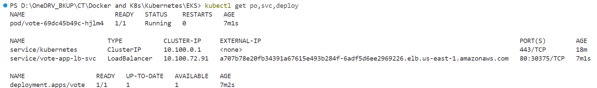
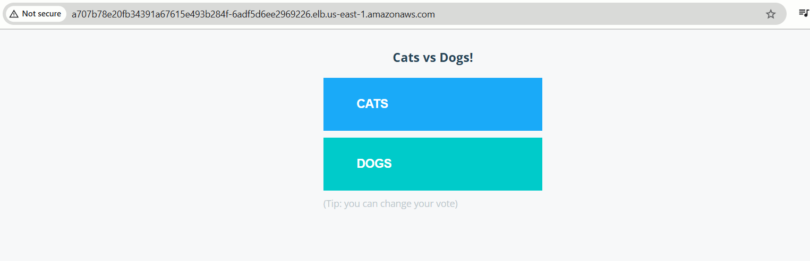

# Publish EKS App on the web using K8s `LoadBalancer` service and `AWS Network Load Balancer` (NLB)

## Step-01: Create App Deployment manifests

```
apiVersion: apps/v1
kind: Deployment
metadata:
  labels:
    app: vote
  name: vote
spec:
  replicas: 1
  selector:
    matchLabels:
      app: vote
  template:
    metadata:
      labels:
        app: vote
    spec:
      containers:
      - image: dockersamples/examplevotingapp_vote
        name: vote
        ports:
        - containerPort: 80
          name: vote
```

## Step-02: Create LoadBalancer manifest to publish App on the web

```
apiVersion: v1
kind: Service
metadata:
  name: vote-app-lb-svc
  labels:
    app: vote
  annotations:
    service.beta.kubernetes.io/aws-load-balancer-type: nlb
    service.beta.kubernetes.io/aws-load-balancer-nlb-target-type: instance
    service.beta.kubernetes.io/aws-load-balancer-name: vote-app-nlb
spec:
  type: LoadBalancer
  selector:
    app: vote
  ports:
    - port: 80
      targetPort: 80
```

## Step-03: Run all the k8s manifests

```
kubectl apply -f .\manifests\eks-nlb-manifests
```

## Verify the deployed resources

```
kubectl get svc | Observe vote loadBalancer service

[You should see a new Loadbalancer service with an endpoint]

# List pods
kubectl get po

# List Deployments | Observe vote deployment
kubectl get deploy
```



## Step-04: Access the EKS hosted Application using NLB endpoint

- To verify the AWS NLB creation, navigate to AWS Management Console >> EC2 >> Load Balancing >> Load Balancers >> You should see a Network Load Balancer (NLB).

- To access the application, open the browser and visit _NLB DNS Name_



## Step-05: Delete the created resources

```
kubectl delete -f .\manifests\eks-nlb-manifests\
```

## References

- https://kubernetes-sigs.github.io/aws-load-balancer-controller/v2.2/guide/service/nlb/
- https://kubernetes-sigs.github.io/aws-load-balancer-controller/v2.2/guide/service/annotations/
