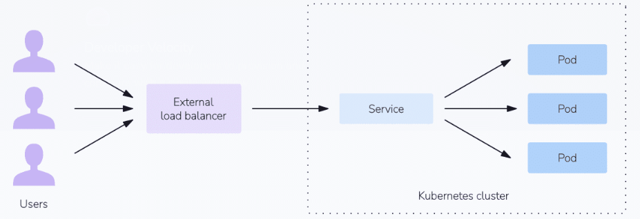

# Amazon EKS Bootcamp

# HTML table with Cell merge

<table>
    <thead>
        <tr>
            <th>Serial No</th>
            <th>Topic</th>
            <th>Description</th>
        </tr>
    </thead>
    <tbody>
        <tr>
            <td>1</td>
            <td>[Amazon EKS Basics](./01-eks-basics.md)</td>
            <td>Fundamentals of K8s concepts</td>
        </tr>
        <tr>
            <td>2</td>
            <td>[Setting-up EKS Cluster](./02-setting-up-eks-cluster.md)</td>
            <td>Setting-up EKS Cluster</td>
        </tr>
    </tbody>
</table>

## Review kube config file

- search for .kube directory in your home directory >> config file

## Deploy nginx application

- Refer to the manifests/nginx-deployment.yml

```
kubectl apply -f manifests/nginx-deployment.yml

kubectl get all

# Revise the replica count to 10 and re-run the manifests
kubectl apply -f manifests/nginx-deployment.yml

[Most of the pods will go in pending state due to resource crunch]
[You may revise the instance type to accomodate more pods]
```

## Managing Users & RBAC in EKS

### 01. Create a cluster admin

- Create an IAM User

  - IAM >> Users >> Create >> Name: k8s-cluster-admin >> Don't assign any policy for now >> Create
  - Generate the access keys for the above create user and download it.
  - Now, connect to EKS cluster and run following commands:

  ```
  kubectl get configmap -n kube-system

  kubectl get configmap -n kube-system aws-auth -o yaml > aws-auth-configmap.yml
  [preceding command will have info about role & mapUsers info]

  vi aws-auth-configmap.yml

  [Scroll to mapUsers section and add the following]
  - userarn: arn:aws:iam::<account-id>:user:k8s-cluster-admin
    username: k8s-cluster-admin
    groups:
      - system:masters

  [Save & exit from the file]

  # Apply the updated aws-auth-configmap file changes
  kubectl apply -f aws-auth-configmap.yml
  ```

- Add the IAM user credentials to the .aws credentials file

  - %HOMEPATH%/.aws/credentials >> Open in notepad
  - Add credentials for k8s-cluster-admin user in a new profile

  ```
  [clusteradmin]
  aws_access_key_id=
  aws_secret_access_key=
  region=us-east-1
  output=json
  ```

  - Check the current IAM user credentials being used

  ```
  aws sts get-caller-identity

  # Set the AWS_PROFILE environment variable to prod-reader user
  $env:AWS_PROFILE="clusteradmin"

  # After updating, again check the current IAM user creds being used
  aws sts get-caller-identity
  ```

- Test the setup

```
kubectl get pods -n kube-system

[Try anything and it should work]
```

### 02. Create a Read-only user with only access to a namespace

- Create a Namespace

```
kubectl create namespace production
```

- Create an IAM User

  - IAM >> Create >> Name: prod-reader >> no console access >> no policies attached.
  - Generate the keys and download it.

- Create a K8s Role & Role Binding

  - For Role, refer to the role-node-reader.yml
  - For RoleBinding, refer to the rolebinding-prod-reader.yml

```
kubectl apply -f role-node-reader.yml
kubectl apply -f rolebinding-prod-reader.yml
```

- Update the aws-auth configMap

```
kubectl -n kube-system get configmap aws-auth -o yaml > aws-auth-configmap.yml

vi aws-auth-configmap.yml

[Scroll all the way to the mapUsers section and following snippet]
- userarn: arn:aws:iam::<account-id>:user:prod-reader
  username: prod-reader
  groups:
    - prod-reader-role

[Save & exit from the file]

# Apply the updated aws-auth-configmap file changes
kubectl apply -f aws-auth-configmap.yml
```

- Add the IAM user credentials to the .aws credentials file

  - %HOMEPATH%/.aws/credentials >> Open in notepad
  - Add credentials for prod-reader user in a new profile

  ```
  [productionreader]
  aws_access_key_id=
  aws_secret_access_key=
  region=us-east-1
  output=json
  ```

  - Check the current IAM user credentials being used

  ```
  aws sts get-caller-identity

  # Set the AWS_PROFILE environment variable to prod-reader user
  $env:AWS_PROFILE="productionreader"

  # After updating, again check the current IAM user creds being used
  aws sts get-caller-identity
  ```

- Test the setup

```
kubectl get pods

kubectl get pods -n kube-system

[You should get an error as a prod-reader you can only read resources of production namespace]

kubectl get pods -n production
```

## EKS Load Balancers

- EKS supports following load balancers:

  - Classic Load Balancer
  - Network Load Balancer
  - Application Load Balancer

- `Classic and Network load balancers` are of k8s service type `LoadBalancer`
- `Application load balancer` is for `Ingress Controller`



- Types of load balancers available in Kubernetes

  - LoadBalancer
  - ClusterIP
  - NodePort
  - Ingress Controller

```
# In order to modify default loadbalancer service

# Create internal loadbalancer service
annotations:
    service.beta.kubernetes.io/aws-load-balancer-internal: "true"

# Create AWS NLB (default is classic)
annotations:
    service.beta.kubernetes.io/aws-load-balancer-type: "nlb"
```

## Configure Application with HPA

- Reference: https://kubernetes.io/docs/tasks/run-application/horizontal-pod-autoscale-walkthrough/

- Install metrics server

```
kubectl get deployment metrics-server -n kube-system

kubectl apply -f https://github.com/kubernetes-sigs/metrics-server/releases/latest/download/components.yaml

kubectl get deployment metrics-server -n kube-system
```

- Create app deployment, service and HPA manifests - refer hpa-deployment-svc.yml file

Run the following command to execute above manifest:

```
kubectl apply -f hpa-deployment-svc.yml

# List all the resources in default namespace
kubectl get all

[You should see hpa, pods, replicaSet, deployment, service]
```

- Increase the load (artificially) on app pods

```
kubectl run -i --tty load-generator --rm --image=busybox:1.28 --restart=Never -- /bin/sh -c "while sleep 0.01; do wget -q -O- http://php-apache; done"
```

- See pods scaling in action. To do this, you'll start a different Pod to act as a client. The container within the client Pod runs in an infinite loop, sending queries to the php-apache service.

```
# Press Ctrl+C to end the watch when you're ready
kubectl get hpa php-apache --watch
```

- Within a minute or so, you should see the higher CPU load; and then, more replicas.

## For HPA metrics resources

```
 metrics:
  - type: Resource
    resource:
      name: memory
      target:
        type: AverageValue
        averageValue: 500Mi

-----------------------------
type: Pods
pods:
  metric:
    name: packets-per-second
  target:
    type: AverageValue
    averageValue:

-----------------------------
type: Object
object:
  metric:
    name: requests-per-second
  describedObject:
    apiVersion: networking.k8s.io/v1
    kind: Ingress
    name: main-route
  target:
    type: Value
    value: 2k
```

## EKS Cluster Autoscaler

- Assuming you have an EKS cluster.
- Check AWS Auto-scaling group, IAM Roles associated with the worker nodes.

- Install & Configure Cluster Autoscaler

## `Vertical Pod Autoscaling` using `Goldilocks`

- Reference: https://github.com/kubernetes/autoscaler/tree/master/vertical-pod-autoscaler

## Namespaces

- Can be used to logically isolate resources in K8s
- You can also control the amount of resource to be allocated to a namespace

```
kubectl get namespaces

kubectl get pods

kubectl get pods -n kube-system

kubectl get pods --namespace kube-system

kubectl get all -n kube-system
```

- Create a new Namespace

```
kubectl create namespace dev-ns
```

- Create a resource quota

```
apiVersion: v1
kind: ResourceQuota
metadata:
  name: mem-cpu-demo
spec:
  hard:
    requests.cpu: "1"
    requests.memory: 1Gi
    limits.cpu: "2"
    limits.memory: 2Gi
```

Execute above manifest:

```
kubectl apply -f resource-quota-namespace.yml --namespace=quota-mem-cpu-example

# View more info about above quota
kubectl get resourcequota mem-cpu-demo --namespace=quota-mem-cpu-example --output=yaml
```

- The ResourceQuota places these requirements on the quota-mem-cpu-example namespace:

  1. For every Pod in the namespace, each container must have a memory request, memory limit, cpu request, and cpu limit.
  2. The memory request total for all Pods in that namespace must not exceed 1 GiB.
  3. The memory limit total for all Pods in that namespace must not exceed 2 GiB.
  4. The CPU request total for all Pods in that namespace must not exceed 1 cpu.
  5. The CPU limit total for all Pods in that namespace must not exceed 2 cpu.

- Now, create a Pod - resource-quota-ns-pod.yml

```
apiVersion: v1
kind: Pod
metadata:
  name: quota-mem-cpu-demo
  namespace: quota-mem-cpu-example
spec:
  containers:
  - name: quota-mem-cpu-demo-ctr
    image: nginx
    resources:
      limits:
        memory: "800Mi"
        cpu: "800m"
      requests:
        memory: "600Mi"
        cpu: "400m"
```

## Kubernetes Dashboard - Web-based Interface

## Tip: Combining config into single file

## Load Balancer `Services`

- ClusterIP service
- NodePort service
- LoadBalancer service

### 01. ClusterIP service

### 02. NodePort service

### 03. LoadBalancer service

## EKS Ingress

- References

  - https://docs.aws.amazon.com/eks/latest/userguide/auto-elb-example.html
  - https://docs.aws.amazon.com/eks/latest/userguide/aws-load-balancer-controller.html
  - https://docs.aws.amazon.com/eks/latest/userguide/auto-enable-existing.html

- Ingress Controllers

  - nginx
  - haproxy
  - traefik

- AWS Auto is required (else have to install alb-ingress-controller+alb)

## EKS

## EKS Logging & Monitoring

- Logging and Monitoring using fluent
- Logging and Monitoring using fluentbit
- Logging and Monitoring using prometheus

## Linux Essentials

## Git Essentials

## DevOps Essentials
